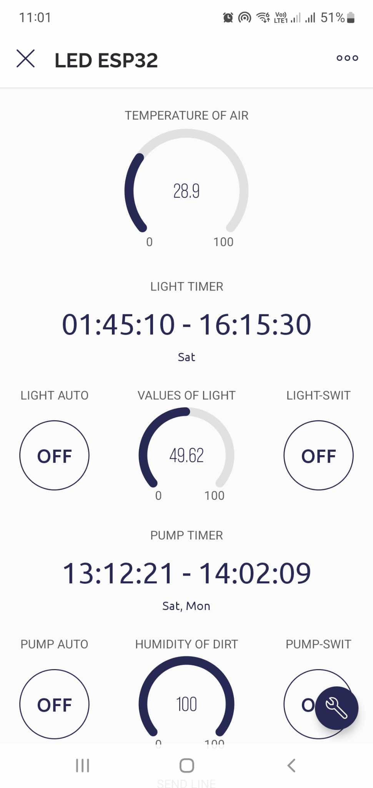
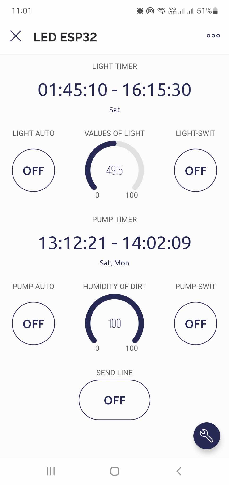
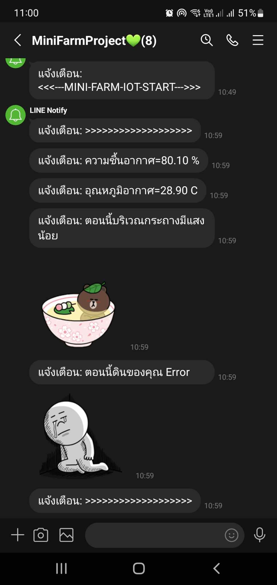
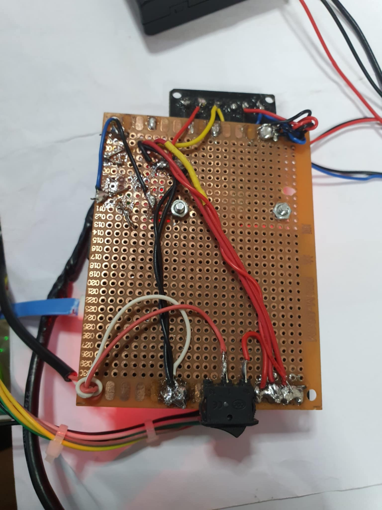
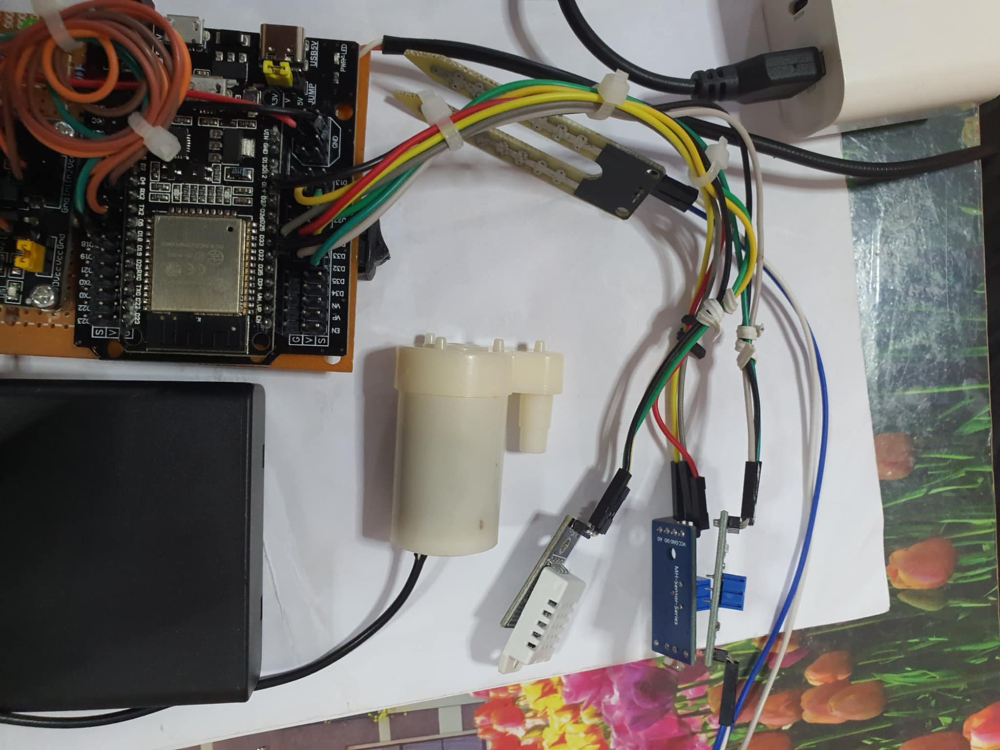
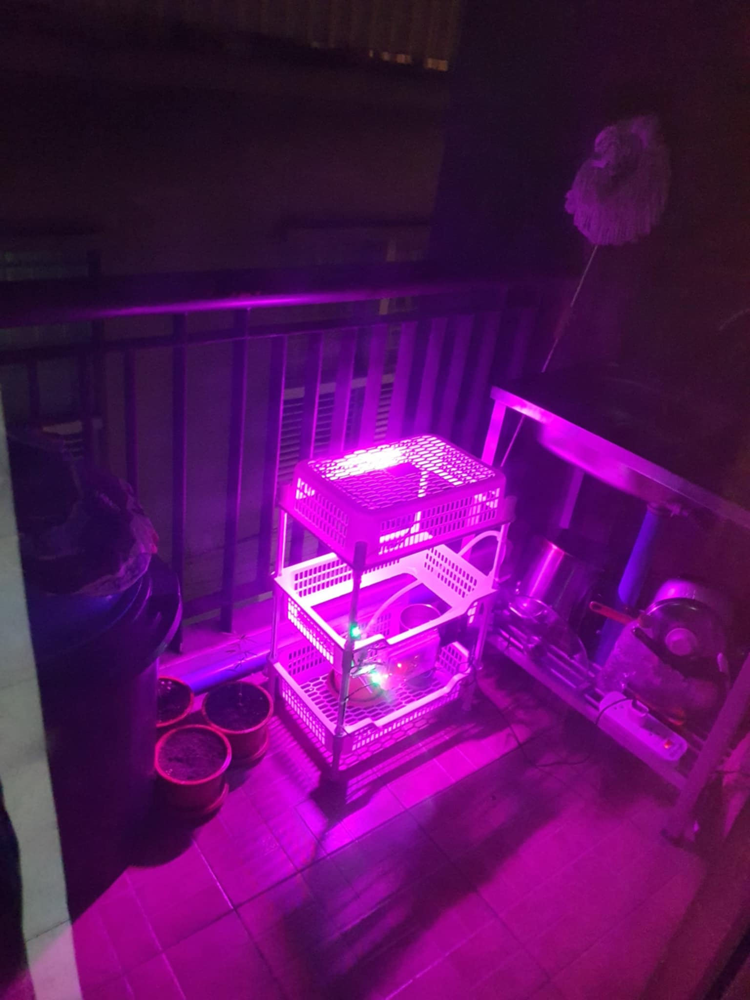
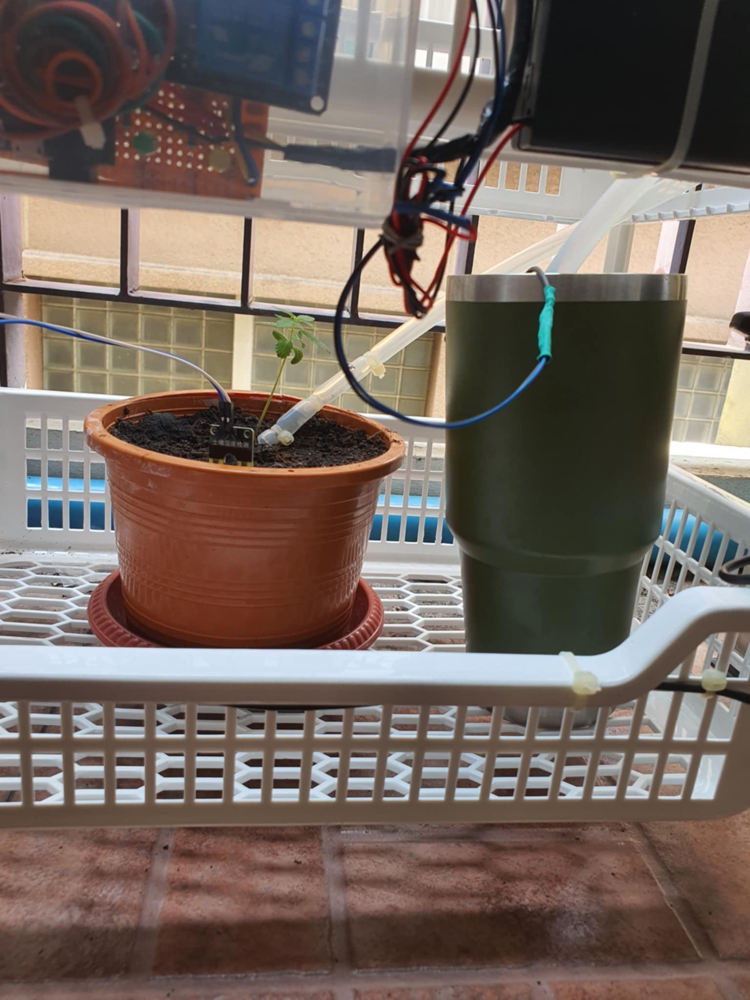
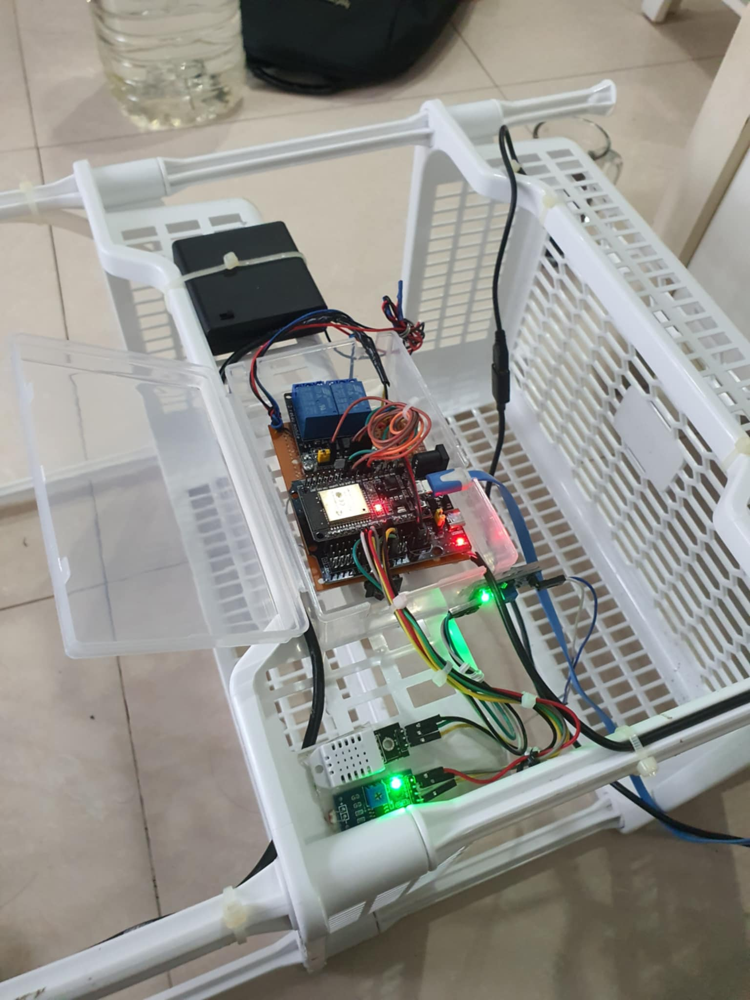

# 🌿 Mini Farm Project (C++ / ESP32)

A DIY smart mini farm using **ESP32**, designed for home gardening and submitted as a university assignment in **Year 2, Semester 1**. The system automates plant watering and lighting based on real-time sensor data and supports IoT integration with **Blynk**, **Google Sheets**, and **LINE Notify**.

This project was developed as part of a university assignment in **Year 2, Semester 1**.

---

## 📦 Project Summary

This project monitors various environmental parameters such as temperature, humidity, soil moisture, and light intensity. It controls actuators like a water pump and plant LED light through a relay module and allows remote control and monitoring via a smartphone app.

---

## 🚀 Features

- 🌡️ Real-time air temperature & humidity monitoring
- 🌱 Soil moisture level detection and automatic watering
- 💡 Light-dependent plant LED activation
- ⏲️ Scheduled pump/light control via Blynk App
- 📲 Remote monitoring and control using **Blynk**
- 📊 Sensor data logging to **Google Sheets**
- 🔔 LINE Notify integration for alerts
- 🌍 Based on **ESP32 NodeMCU**, programmable via Arduino IDE
- 📱 Mobile app interface via Blynk

---

## 🧪 Inputs (Sensors)

| Sensor Module              | Description                         |
|---------------------------|-------------------------------------|
| 🌡️ DHT22 (AM2302)          | Measures air temperature and humidity |
| 🌱 Soil Moisture Sensor    | Detects soil wetness levels         |
| 💡 Photoresistor (LDR)     | Detects ambient light intensity     |

---

## ⚙️ Outputs (Actuators)

| Actuator                   | Function                            |
|---------------------------|-------------------------------------|
| 💧 Mini DC Water Pump      | Irrigates the plant when soil is dry |
| 🌞 LED Light for Plants    | Provides light when ambient light is low |

---

## 🔌 Relay Control

- **Relay Module (2 Channel, 5V, Active LOW)** to switch:
  - 💧 Water Pump
  - 🌞 Plant LED Light

---

## 🔋 Microcontroller Board

- **ESP32 NodeMCU (ESP-WROOM-32)**  
  Used to read sensor data, control relays, and communicate with IoT services.

---

## 📲 IoT Integration

| Platform        | Purpose                                  |
|----------------|------------------------------------------|
| 📱 Blynk App     | Remote monitoring and control interface |
| 📊 Google Sheets | Logging sensor data in real-time        |
| 🔔 LINE Notify   | Sends real-time notifications/alerts     |

---

## 🎓 Academic Context

This project was developed as part of a home automation assignment in university. It combines embedded systems, real-world sensor/actuator control, and cloud-based IoT integration using modern tools.

---

## 📸 Screenshots & Diagrams

| Main Screen | Timersetting Screen | LINE Notification |
|-------------|---------------------|-------------------|
|  |  |  |

| Real Image 1 | Real Image 2 | Real Image 3 | Real Image 4 | Real Image 5 |
|--------------|--------------|--------------|--------------|--------------|
|  |  |  |  |  |

---

